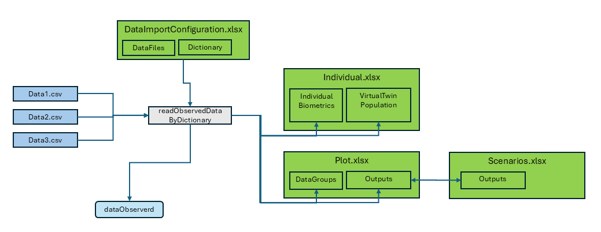

# Data Import by Dictionary

## Overview

This vignette provides a detailed guide to the data import process
within the OSPSuite Reporting Framework package. The key aspects of the
data import functionality are as follows:

- **Data Types**: The package supports importing both observed time
  profiles and pharmacokinetic (PK) parameters, which can be processed
  as either aggregated or individual datasets.

- **File Format**: Source files must be formatted as CSV tables.

- **Import Function**: The primary function used for data import is
  `readObservedDataByDictionary`.

- **Configuration File**: Data import configuration is managed through
  the “DataImportConfiguration.xlsx” file, which consists of:

  - A `DataFiles` sheet listing all files to be imported.
  - Dictionary sheets that outline the import specifications and rules.

- **Output**: The import process generates two data.tables:

  - `dataObserved`: Contains time profile data.
  - `dataObservedPK`: Contains PK parameter data.

- **Data Transfer**: The import function also facilitates the transfer
  of additional data to other configuration sheets:

  - It populates the `IndividualBiometrics` sheet in `Individuals.xlsx`
    with all available data.
  - It creates a new sheet, `VirtualTwinPopulation`, in
    `Individuals.xlsx` that includes individual data suitable for
    generating a virtual twin population (refer to the Population
    vignette for more details).
  - It appends the output identifier and data group identifier, along
    with all available data, to the corresponding sheets in `Plot.xlsx`
    and `Scenario.xlsx`.



Overview of Data Import

## Using the `readObservedDataByDictionary` Function

The `readObservedDataByDictionary` function plays a pivotal role in the
data import process within our package. It is designed to read and
process observed data based on the provided project configuration and
the data dictionary defined in an Excel template. Here’s how to use the
function and fill the Excel table for effective data import:

1.  **Provide Project Configuration**: The function requires the project
    configuration data to be passed as an argument. This configuration
    should include the necessary information for data import, such as
    the data importer configuration file and project configuration
    directory path.

2.  **Data Importer Configuration File**: Ensure that the Excel template
    containing the data dictionary and data file information is
    available and accessible to the function. The data dictionary in the
    Excel template defines the mapping and conversion rules for the
    observed data.

3.  **Invoke the Function**: Call the `readObservedDataByDictionary`
    function, passing the project configuration as an argument. The
    function will read the data files and process the observed data
    based on the provided dictionary and configuration. It will return
    the observed data as a data.table, ready for further analysis.

``` r
# Call the readObservedDataByDictionary function
observedData <- readObservedDataByDictionary(projectConfiguration)
```

## Filling the Excel Table

To effectively fill the Excel table for use with the
`readObservedDataByDictionary` function, follow these guidelines:

### `DataFiles` Sheet:

In the “DataFiles” sheet of the Excel template, provide the following
information:

- **`FileIdentifier`** : An identifier that can be used for filtering
  the file.
- **`DataFile`**: The path of the CSV file relative to the configuration
  Excel.
- **`Dictionary`**: The sheet name for the data dictionary.
- **`DataFilter`**: An R executable expression that filters relevant
  data for the study. If empty, no filter is applied.
- **`DataClass`**: Differentiate between time profiles and PK
  parameters, as well as aggregated and individual data.

#### Example

In the example below, we want to read data from three source files.
“data1” and “data2” have the same format and use the same dictionary for
the import, while “data3” uses the dictionary “tpDictionaryAggregated”.
All used dictionaries must be part of the
“DataImportConfiguration.xlsx.”

For `data1`, we need all rows; for the other two files, we have defined
filters. In `data2`, we want to exclude all flagged with `PKFLAG > 0`,
and in `data3`, we want to exclude data from study 1234.

| FileIdentifier | DataFile                   | Dictionary             | DataFilter   | DataClass     |
|:---------------|:---------------------------|:-----------------------|:-------------|:--------------|
| data1          | relative/path/to/data1.csv | tpDictionary           |              | tp Individual |
| data2          | relative/path/to/data2.csv | tpDictionary           | PKValue == 1 | tp Individual |
| data3          | relative/path/to/data3.csv | tpDictionaryAggregated | STUD != 1234 | tp Aggregated |

The first line of the sheet is not shown above; it contains descriptions
for the columns. The information for the data import starts at line 2.

### “tpDictionary” Sheet:

The configuration sheet provides two templates for dictionaries:
“tpDictionary” and “pkDictionary”. They have the following columns:

- **targetColumn**: Internal column name of the package.  

- **type**: Type of parameter used by the package. The following types
  exist:

  - **identifier**:

    - `studyId`: ID of the study.
    - `studyArm`: Study arm.
    - `subjectId`: ID of the subject within the study (not needed for
      aggregated data).
    - `individualId`: Unique individual ID across all studies (not
      needed for aggregated data).
    - `group`: Identifier for the data group, unique across all studies
      and data classes.
    - `outputPathId`: Identifier for the output.

  - **timeprofile** (columns used to process time profiles): The columns
    `xValues`, `yValues`, `yUnit`, and `lloq` are always mandatory. For
    aggregated data, the columns `yErrorValues`, `yErrorType`, `yMin`,
    `yMax`, `numberOfIndividuals`, and `nBelowLLOQ` are also available.

    - `time`: Time values (unit specified in dictionary).
    - `yValues`: Data value.
    - `yUnit`: Unit of data value (also valid for all corresponding
      columns like `lloq`, `yErrorValues`).
    - `lloq`: Lower limit for quantification. For values below `lloq`,
      set `yValues` to `lloq/2`; if not available, set to NA.  
    - `yErrorType`: Type of aggregation range. There are two defaults
      for `yErrorType`:
      - `ArithmeticStdDev`: Interprets `yValues` as mean and
        `yErrorValues` as standard deviation.
      - `GeometricStdDev`: Interprets `yValues` as geometric mean and
        `yErrorValues` as geometric standard deviation.

      For the defaults, the legend is automatically generated, and
      `yMin` and `yMax` are ignored. For non-defaults, `yErrorType` is
      interpreted as legend; it should contain the description of the
      mean and the range, separated by a “\|”. `yErrorValues` are
      ignored, and `yMin` and `yMax` are used. This can be used for
      median and percentiles.
    - `yErrorValues`: Value of aggregation range.
    - `yMin`: Lower range of aggregation range.
    - `yMax`: Upper range of aggregation range.
    - `nBelowLLOQ`: Number of values below `lloq`.
    - `numberOfIndividuals`: Number of values.

  - **pkParameter** (columns used to process PK parameters): The columns
    `values` and `Unit` are always mandatory. For aggregated data, the
    columns `errorValues`, `errorType`, `minValue`, `maxValue`, and
    `numberOfIndividuals` are also available.

    - `values`: Data value.
    - `unit`: Unit of data value (also valid for all corresponding
      columns like `errorValues`).
    - `errorType`: Type of aggregation range. The same defaults exist as
      for `yErrorType` of time profiles.
    - `errorValues`: Value of aggregation range.
    - `minValue`: Lower range of aggregation range.
    - `maxValue`: Upper range of aggregation range.
    - `nBelowLLOQ`: Number of values below `lloq`.

  - **biometrics**: Columns used to create individuals; can also be used
    for covariate analysis. All columns are optional. The values are
    transferred to the ‘Individual.xlsx’ for further use. Available
    columns are:

    - `age`: Age.
    - `weight`: Body weight.
    - `height`: Body height.
    - `gender`: Gender data should be coded as characters “Male” or
      “Female” (case insensitive) or numeric coding (1 = male, 2 =
      female).
    - `population`: Population. Ensure to translate to one of the
      available PK-Sim populations (see
      [`ospsuite::HumanPopulation`](https://www.open-systems-pharmacology.org/OSPSuite-R/reference/HumanPopulation.html)).

  - **covariate**: Columns used for covariate analysis. This is the only
    column type where the name of the target column can be freely
    assigned by the user. Covariates are optional rows.

  - **metadata**: Columns used to add information in the `DataGroup`
    sheet in the plot configuration table. The information is used to
    generate the data import for PK-Sim.

- **sourceColumn**: Name of the column in the source CSV.  

- **sourceUnit**: Unit of the column in the source CSV.  

- **filter**: An R executable expression that filters the source rows.
  Filters are executed in the order of this table.  

- **filterValue**: An R executable expression to set a value for the
  filtered rows.

By filling out the Excel table with the required information, you can
ensure that the `readObservedDataByDictionary` function can effectively
read and process the observed data based on the provided data dictionary
and configuration.

**!!! ATTENTION: Do not use single quotes (’ ’) to capture strings. At
the beginning of an Excel cell, single quotes will be ignored. Use
double quotes (” “).**

#### Example

This sheet is used for individual data.

The `individualId` is constructed as a concatenation of study ID and
individual ID. As we want to do this for all rows, the filter is set to
`TRUE`, and the R expression that performs the concatenation is placed
in the column `filterValue`.

The dictionary contains two rows for the target column `population`. For
the first entry, all data rows where the source column `RACENAME` is
“White” are set to “European_ICRP_2002”, while for the second entry,
individuals identified as “Asian” are set to “Asian_Tanaka_1996”.

Values defined by filters are set sequentially in the order of the
dictionary, so if a data row is selected by different filter conditions,
the filter value at the bottom will define the final value.

The data contains the covariate `country` in the column “COUNTRY”.
Additionally, the metadata `dose` is available.

| TargetColumn | Type        | SourceColumn | SourceUnit | Filter              | FilterValue                                    | Description                                                                                 |
|:-------------|:------------|:-------------|:-----------|:--------------------|:-----------------------------------------------|:--------------------------------------------------------------------------------------------|
| studyId      | identifier  | STUD         |            |                     |                                                | character, study ID                                                                         |
| studyArm     | metadata    | GRPNAME      |            |                     |                                                | character, unique over study, typically study arm                                           |
| subjectId    | identifier  | SID          |            |                     |                                                | character, subject ID                                                                       |
| individualId | identifier  |              |            | TRUE                | paste0(“I”,STUD,SID)                           | character, unique over all studies, ignored by aggregated Data                              |
| group        | identifier  |              |            | TRUE                | paste(STUD, GRPNAME, “individual”, sep = “\_“) | Must be unique over studies and dataclasses                                                 |
| outputPathId | identifier  | MOLECULE     |            |                     |                                                | character, output ID                                                                        |
| xValues      | timeprofile | TIME         | h          |                     |                                                | Time (0 = start of simulation in PK-Sim/Mobi)                                               |
| yValues      | timeprofile | DV           |            |                     |                                                | Units is coded in column “dvUnit”                                                           |
| yUnit        | timeprofile | DVUNIT       |            |                     |                                                | character, dv Unit must be valid PK-Sim unit                                                |
| lloq         | timeprofile | LLOQ         |            |                     |                                                | for values below lloq set dv to lloq/2, if not available set to NA                          |
| age          | biometrics  | AGE          | year(s)    |                     |                                                | optional, please provide source unit                                                        |
| weight       | biometrics  | WGHT0        | kg         |                     |                                                | optional, please provide source unit                                                        |
| height       | biometrics  | HGHT0        | cm         |                     |                                                | optional, please provide source unit                                                        |
| gender       | biometrics  | SEX          |            |                     |                                                | Use characters Male Female (case insensitive) or numeric coding 1=male 2= female            |
| population   | biometrics  |              |            | RACENAME == “White” | “European_ICRP_2002”                           | character, PK Sim population name (get available list by calling ospsuite::HumanPopulation) |
| population   | biometrics  |              |            | RACENAME == “Asian” | “Asian_Tanaka_1996”                            | character, PK Sim population name (get available list by calling ospsuite::HumanPopulation) |
| species      | biometrics  |              |            | TRUE                | “Human”                                        | character, PK-Sim Species name (ospsuite::Species)                                          |
| country      | covariate   | COUNTRY      |            |                     |                                                | example for covariate, please delete if not used                                            |
| dose         | metadata    | DOSE         |            | NA                  |                                                | meta data used for PK-Sim import, if not available, delete row or set all values to NA      |
| molecule     | metadata    |              |            | TRUE                |                                                | meta data used for PK-Sim import, if not available, delete row or set all values to NA      |
| organ        | metadata    |              |            | TRUE                |                                                | meta data used for PK-Sim import, if not available, delete row or set all values to NA      |
| compartment  | metadata    |              |            | TRUE                |                                                | meta data used for PK-Sim import, if not available, delete row or set all values to NA      |

## Other Data Formats

The plot functions in the package workflow for time profile plots accept
observed data in two formats: the `data.table` format generated by the
`readObservedDataByDictionary` function and the `DataCombined` class
format from the `ospsuite-R` package.

The package also provides two functions to convert the data.table format
to DataCombined and vice versa:

``` r
# Convert DataCombined back to data.table format
dataDT <- convertDataCombinedToDataTable(dataCombined)

# Convert data.table to DataCombined format
dataCombined <- convertDataTableToDataCombined(observedData)
```

\`\`\`
