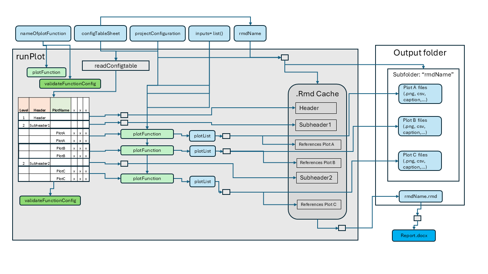
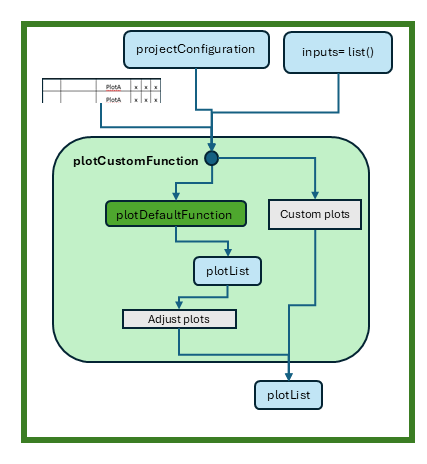

```{r, include = FALSE}
knitr::opts_chunk$set(
  collapse = TRUE,
  eval = FALSE,
  echo = TRUE,
  warning = FALSE,
  error = FALSE,
  message = FALSE,
  comment = "#>"
)
```

```{r setup, echo = FALSE, eval = TRUE}
library(ospsuite.reportingframework)
library(data.table)
```

## Introduction

The `ospsuite.reportingframework` package is designed to streamline the process of generating plots and reports for users in their daily work. It provides a robust set of tools that facilitate the rapid creation of figures and comprehensive reports, allowing users to efficiently visualize and summarize data. 

With this package, users can easily generate a variety of plots, all of which are customizable to meet specific needs. The resulting plots are returned as `ggplot` objects, enabling further manipulation and refinement. Additionally, the package includes an intuitive interface for customizing plots generated by default functions or for integrating entirely new plotting functions.

This vignette will guide you through the key functionalities of the package, including configuration, plot generation, and report creation, ensuring you can leverage its full potential in your analytical workflows.

## Content

This vignette covers the following key topics:

1. **Configuration Table**: An overview of the structure and purpose of the configuration table used for plot generation. This section explains the various sheets involved, their roles, and how to properly set them up for the `runPlot` function.

2. **Plot Generation with `runPlot` for Reporting**: A detailed explanation of how to use the `runPlot` function, including its parameters, the steps it performs, and an illustrative example. This section aims to provide users with a clear understanding of how to generate plots efficiently within their reporting workflows.

3. **Suppressing Export of Plots**: This section describes the optional feature of suppressing output during the plot generation process, allowing users to quickly visualize plots without writing them to the file system. It also covers how to filter plots of interest for quicker development.

4. **Available Plot Functions**: An overview of the various plot functions provided by the package, including their names and descriptions. This section serves as a reference for users to understand the capabilities of the package and to identify which functions to use for their specific needs.

5. **Creating Custom Plot Functions**: Guidance on how to create custom plot functions tailored to specific analytical requirements. This section discusses the use of templates and the integration of custom functions within the existing reporting framework.

6. **Report Generation**: Instructions on how to compile generated plots into a comprehensive report using the `mergeRmds` function to combine multiple `.Rmd` files into a single document. This section also details how to convert R Markdown files into Word documents using the `renderWord` function, highlighting key parameters and providing examples for both functions.


## Configuration Table

The configuration for plot generation is managed through the `projectConfiguration$plotsFile`, which consists of several sheets for general configurations that should not be renamed:

- **Scenarios**: Configures the display names of scenarios in all plot functions.
- **Outputs**: Configures the display names and units of outputs in all plot functions.
- **DataGroups**: Configures the display names of data groups in all plot functions and links data groups to scenarios.
- **ModelParameter**: Defines a list of model parameters that can be used in some plots.
- **TimeRange**: Lists possible time ranges for time profile plots.

In addition to these general configuration sheets, there are templates for plot configurations that can be copied and renamed. The sheet name serves as an input to the `runPlot` function.

All sheets must contain the columns 'Level', 'Header', and 'PlotName'. In each row, either the 'Level' and 'Header' columns should be filled to generate a structure of headers in the markdown document, or the 'PlotName' should be filled to group rows for evaluation by the `runPlot` function. The other columns are specific to the respective plot function, with the second row in each sheet providing guidance on how to use them.

## Plot Generation with runPlot for Reporting

The `runPlot` function is the primary interface for generating plots within the workflow. It requires the following mandatory parameters:

- `nameOfplotFunction`: The name of the plot function to execute.
- `projectConfiguration`: The configuration object containing project settings and paths.
- `inputs`: A list of additional inputs required by the specific plot function.

The `runPlot` function executes several steps to generate the plots:

1. Evaluates `nameOfplotFunction` to check for its availability.
2. Checks if a validation function for the plot configuration table is available; if not, the default validation function is used.
3. Creates a subfolder in the `projectConfiguration$outputFolder`, named according to the input variable `rmdName`, which defaults to the config table sheet name.
4. Reads and validates the configuration table defined by `configTableSheet`.
5. Iterates over the rows of the configuration table:
   - If the 'Level' and 'Header' columns are filled, a header is created in the Rmd cache.
   - If the 'PlotName' is filled, all rows with the same plot name are filtered, and this sub-table serves as input for the plot function. The return value is a list of ggplot objects or tables, which are exported to the subfolder 'rmdName', with references made in the Rmd cache.
6. Finally, the Rmd cache is written as a markdown document to the `projectConfiguration$outputFolder`, named `<rmdName>.Rmd`, which can be used for report generation.

Refer to the function help for additional details on `runPlot`.

{width=70%}

### Example Call

Below is an example call to create time profiles using the `plotTimeProfiles` function. The configuration sheet in this example is called "myTimeProfile", and `projectConfiguration` serves as the configuration object containing project settings and paths. The list `inputs` includes input parameters specific to the `plotTimeProfiles` function, which requires a list of `scenarioResults` and optionally takes `dataObserved` for plotting.

```{r example-runPlot}
runPlot(
  nameOfplotFunction = "plotTimeProfiles",
  configTableSheet = "myTimeProfile",
  projectConfiguration = projectConfiguration,
  inputs = list(
    scenarioResults = scenarioResults,
    dataObserved = dataObserved
  )
)
```

### Suppressing Export of Plots

The `runPlot` function includes an optional input variable `suppressExport` (default is `FALSE`). When set to `TRUE`, all actions that produce output on the file system are suppressed, meaning no plot exports or Rmd files are created. Instead, `runPlot` returns the plot list as a list.

Additionally, the `plotNames` input allows you to select specific plots defined in your input configuration. If this variable is set, `runPlot` will automatically set `suppressExport` to `TRUE` and filter the plot configuration to the plots of interest. This mode is particularly useful during the development of plots, as it allows for quick results in the form of ggplot objects that can be easily visualized and modified.

## Plot Functions

### Available Plot Functions

The table below provides an overview of all plot functions available in this package. For further information, please refer to the respective function help and the vignettes titled `Tutorial Time Profiles` and `PKParameter_Boxplot`.

```{r function-overview, echo=FALSE, eval=TRUE}
dt = list(TimeProfiles = 
            data.table('Function name' = 'plotTimeProfiles',
                       Description = 'Create time profile plots'),
          PKParameter_Boxplot = 
            data.table('Function name' = 'plotPKBoxwhisker',
                       Description = 'Creates box-whisker plots of PK parameters'),
          PKParameter_Forest = 
            data.table('Function name' = paste(c('plotPKForestAggregatedAbsoluteValues', 
                       'plotPKForestPointEstimateOfAbsoluteValues', 
                       'plotPKForestAggregatedRatios', 
                       'plotPKForestPointEstimateOfRatios'),
                       collapse = ' '),
                       Description = 'Creates forest plots of PK parameters'),
          Histograms = 
            data.table('Function name' = 'plotHistograms',
                       Description = 'Creates histograms of PK parameters or population parameters'),
          DistributionVsRange = 
            data.table('Function name' = 'plotDistributionVsDemographics',
                       Description = paste('Creates range plots of PK parameters or population parameters',
                       'versus a population parameter')),
          SensitivityPlots = 
            data.table('Function name' = 'plotSensitivity',
                       Description = 'Creates plots to display the results of the sensitivity analysis.'))

dt <- rbindlist(dt, idcol = 'Template sheet')

knitr::kable(dt, caption = 'List of available template sheets and corresponding functions')
```

## Creating Custom Plot Functions

Custom plot functions enable the generation of specific visualizations tailored to your analytical needs. To assist in creating these custom functions, you can open a template using the RStudio Addins. Simply navigate to the Addins menu in RStudio and select "Open Template Plot Function." Alternatively, you can use the following function to open the template directly `r openFigureTemplate()`.

This will provide you with a pre-structured and well documented template to help you get started with your custom plot function.

The `runPlot` function will generate the inputs `projectConfiguration`, `onePlotConfig`, and all inputs defined in the `inputList`. With this input, you can generate your own code, either by calling an available plot function and adapting the resulting plot list or by starting from scratch. Each plot function must return a list of plots, ensuring seamless integration with the existing reporting framework.

{width=35%}

# Report Generation

 After generating the plots, the workflow can compile these plots into a comprehensive report. The report is also generated in R Markdown format, allowing for flexible formatting and easy updates.

The first step of the report generation is typically handled by the `mergeRmds` function, which combines multiple `.Rmd` files into a single report document. This allows users to compile results from different plot functions into one cohesive document.

```{r mergeRmds,echo=TRUE,eval=FALSE}
mergeRmds(
  projectConfiguration = projectConfiguration,
  newName = "appendix",
  title = "Appendix",
  sourceRmds = c("Demographics", "TimeProfile", "PKParameter", "DDIRatio", "myFigures")
)
```

The `renderWord` function takes an R Markdown file and generates a Word document using a specified conversion template. This functionality allows users to create well-formatted reports that can be easily shared and presented.

Key Parameters:

- `fileName`: The name of the `.Rmd` file to convert to Word format.
- `wordConversionTemplate`: An optional template used for the conversion. If not provided, a default template will be used.
- `customStyles`: A list of custom styles for figure and table captions and footnotes. The styles should be defined in the `wordConversionTemplate`.


```{r renderWord, echo=TRUE, eval=FALSE}
renderWord(
  fileName = "myReport.Rmd",
  wordConversionTemplate = "path/to/template/myTemplate.docx",
  customStyles = list(FigureFootnote = "myFootnoteFormat", TableFootnote = "myFootnoteFormat")
)
```

In this example, the `renderWord` function converts the specified R Markdown file into a Word document, applying the custom styles defined for footnotes.

