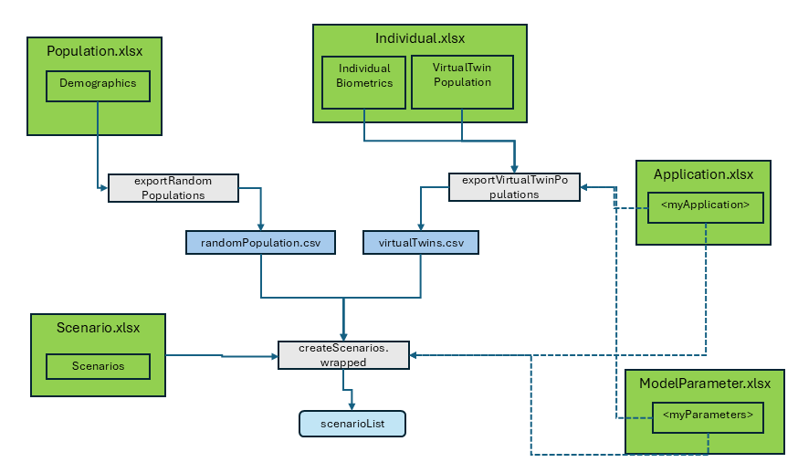

```{r, include = FALSE}
knitr::opts_chunk$set(
  collapse = TRUE,
  eval = FALSE,
  echo = TRUE,
  warning = FALSE,
  error = FALSE,
  message = FALSE,
  comment = "#>"
)
```

```{r setup}
library(ospsuite.reportingframework)
options(rmarkdown.html_vignette.check_title = FALSE)
```



The package supports two population workflows:

- Use **Virtual Twin Population** when observed individual biometrics are available.
- Use **Random Population** when you want synthetic populations generated from demographic ranges.

Both workflows export CSV population files to `<rootdirectory>/Models/Populations`.

### Virtual Twin Population

Virtual twins are generated from observed individual biometrics. Known biometrics are taken from observed data, and missing characteristics are completed from model defaults.

When data are imported with `readObservedDataByDictionary()`, the sheet `VirtualTwinPopulation` is added to `Individual.xlsx` automatically. If observed data are loaded by another route, create this configuration explicitly:

```{r, eval=FALSE}
setupVirtualTwinPopConfig(
  projectConfiguration = projectConfiguration,
  dataObserved = dataObserved
)
```

You can then export one or more configured virtual twin populations:

```{r, eval=FALSE}
exportVirtualTwinPopulations(
  projectConfiguration = projectConfiguration,
  modelFile = "MyModel.pkml",
  overwrite = FALSE,
  populationNames = NULL
)
```

This export adds `ObservedIndividualId` to preserve the mapping to observed individuals.

Use `PopulationName` as `PopulationId` in scenario setup and set `ReadPopulationFromCSV = TRUE`.

If the same parameters are set by both population and scenario configuration, scenario settings take precedence.

### Random Population

Random populations are generated from demographic ranges (for example age and body weight) and optional parameter distributions.

Configure random populations in the `Demographics` sheet of `Population.xlsx`.
Population identifiers are defined in `PopulationName`. Optional per-population parameter sheets can define distributed parameters.

```{r, eval=FALSE}
exportRandomPopulations(
  projectConfiguration = projectConfiguration,
  populationNames = NULL,
  overwrite = FALSE
)
```

The `customParameters` argument can be used to set model-specific parameter values that are not defined in the demographics table.

In the scenario setup, you can use the `PopulationName` as `PopulationId` and set the column `ReadPopulationFromCSV` to 1 (TRUE). (With `ReadPopulationFromCSV = 0 (FALSE)`, the population will be generated anew during the scenario setup. The usage of the distributed parameters is not yet implemented this way; only the demographics will be considered. Additionally, since it is currently not possible to set a seed, each scenario setup will produce a new population.)

