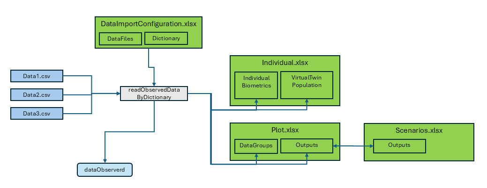

```{r, include = FALSE}
knitr::opts_chunk$set(
  collapse = TRUE,
  comment = "#>"
)
options(rmarkdown.html_vignette.check_title = FALSE)
```

```{r setup, echo=FALSE,warning=FALSE,error=FALSE,message=FALSE}
library(ospsuite.reportingframework)
library(data.table)
library(tidyr)
```

# Overview

This vignette aims to provide a comprehensive understanding of the data import process within the package. 

- Data import works for observed time profiles and pk-parameter, both can be aggregated or individual

- source files are expected to be filed as csv tables

- The import function is readObservedDataByDictionary

- Configuration is done via "DataImportConfiguration.xlsx"
     one sheet "DataFiles" with a list of all files which should be imported
     and dictionary sheets with define how the import is done
     
- result is one data.table 'dataObserved' for time profiles and one data.table 'dataObservedPK' for PK Parameter


- the import function transfers also available data to other configuration sheets
  - if fills the sheet "IndividualBiometrics" ins "Individuals.xlsx" with all avialable data
  - it adds a new sheet "VirtualTwinPopulation" to "Individuals.xlsx"with Individual data appropriate for the generation of a virtual Twim Population (see vignette Population)
  - it adds the output identifier and datagroup identifier with all available data to the corresponding sheets in "Plot.xlsx" and "Scenario.xlsx"
  




# Using readObservedDataByDictionary Function

The readObservedDataByDictionary function plays a pivotal role in the data import process within our package. It is designed to read and process observed data based on the provided project configuration and the data dictionary defined in an Excel template. Here's how to use the function and fill the Excel table for effective data import:

1. Provide Project Configuration: The function requires the project configuration data to be passed as an argument. This configuration should include the necessary information for data import, such as the data importer configuration file and project configuration directory path.

2. Data Importer Configuration File: Ensure that the Excel template containing the data dictionary and data file information is available and accessible to the function. The data dictionary in the Excel template defines the mapping and conversion rules for the observed data.

3. Invoke the Function: Call the readObservedDataByDictionary function, passing the project configuration as an argument. The function will read the data files and process the observed data based on the provided dictionary and configuration. It will return the observed data as a data.table, ready for further analysis.


```{r readObservedDataByDictionary, eval = FALSE, echo = TRUE}
# Call the readObservedDataByDictionary function
observedData <- readObservedDataByDictionary(projectConfiguration)
```


# Filling the Excel Table

```{r load-template, eval=TRUE, echo=FALSE}
templateFilePath <- system.file("templates", "DataImportConfiguration.xlsx",
  package = "ospsuite.reportingframework", mustWork = TRUE
)

dataFilesSheet <-
  xlsxReadData(
    wb = templateFilePath,
    sheetName = "DataFiles",
    skipDescriptionRow = TRUE,
    emptyAsNA = FALSE,
    convertHeaders = FALSE
  )
tpDictionary <-
  xlsxReadData(
    wb = templateFilePath,
    sheetName = "tpDictionary",
    skipDescriptionRow = TRUE,
    emptyAsNA = FALSE,
    convertHeaders = FALSE
  )
```

To effectively fill the Excel table for use with the `readObservedDataByDictionary` function, follow these guidelines:

## "DataFiles" Sheet: 

In the "DataFiles" sheet of the Excel template, provide the following information:

-**FileIdentifier**: Identifier which can be used for filtering the file.
- **DataFile**: Path of the CSV file relative to the configuration XLSX.
- **Dictionary**: Sheet name for the data dictionary.
- **DataFilter**: An R executable expression that filters relevant data for the study. If empty, no filter is applied.
- **DataClass**: Differentiate between time profiles and pkParameter and aggregated and individual data.

### Example

In the example below we want to read data from 3 source files. 
"data1" and "data2" have the same format and use the same dictionary for the import, for data3 the dictionary "tpDictionaryAggregated" is used. All used dictionaries have to be part of the "dataImportConfiguration.xlsx."

For Data1 we need all rows, for the other two we have filter defined. In Data2 we want to exclude all flagged wit a `PKFLAG > 0` and In Data3 we want to exclude data from study 1234


```{r echo=FALSE,eval=TRUE}
dataFilesSheet <- rbind(
  dataFilesSheet[FALSE, ],
  data.table(
    FileIdentifier = c("data1", "data2", "data3"),
    DataFile = c(
      "relative/path/to/data1.csv",
      "relative/path/to/data2.csv",
      "relative/path/to/data3.csv"
    ),
    Dictionary = c(
      "tpDictionary",
      "tpDictionary",
      "tpDictionaryAggregated"
    ),
    DataFilter = c("", "PKValue == 1", "STUD != 1234"),
    DataClass = c(DATACLASS$tpIndividual, DATACLASS$tpIndividual, DATACLASS$tpAggregated)
  )
)

knitr::kable(dataFilesSheet)
```

The first line of the sheet is not shown above It contains descriptions for the columns. The information for the data import starts at line 2.


## "tpDictionary" Sheet: 

The configuration sheet provides two templates for dictionaries "tpDictionary" and "pkDictionary". They have the following columns:

  - **targetColumn**: Internal column name of the package.  
  - **type**: Type of parameter used by the package. 
      following types exist: 
      
      - **identifier**:  
         - studyId: id of study
         - studyArm: study arm
         - subjectId: id of subject with the study (not needed for aggregated data)
         - individualId: unique individual id over all studies (not needed for aggregated data)
         - group: identifier for data group, is unique over all studies and data classes
         - outputPathId: identifier for the output.
         
      - **timeprofile** (columns used to process time profiles)
         The columns 'xValues','yValues','yUnit','lloq' are always mandatory, 
         for aggregated data the columns 'yErrorValues', 'yErrorType', 'yMin', 'yMax', 'numberOfIndividuals' and 'nBelowLLOQ' are also available.
      
        - time: time values, unit is specified in dictionary
        - yValues: data value
        - yUnit: unit of data value, (is also valid for all corresponding columns like lloq, yErrorValues)
        - lloq: lower limit for quantification,  for values below lloq set yValues to lloq/2, if not available set to NA  
        - yErrorType: type of aggregation range 
          There are two defaults for `yErrorType`:
         
           - `ArithmeticStdDev` interprets `yValues` as mean and `yErrorValues` as standard deviation
           - `GeometricStdDev` interprets `yValues` as geomean and `yErrorValues` as geometric standard deviation
         
           For the defaults the legend is automatically generated and `yMin` and `yMax` are ignored.
           For non defaults `yErrorType` is interpreted as legend, it should contain the description of the man and the range, separated by a "|"
           `yErrorValues`are ignored and `yMin` and `yMax` are used.
          This can be used e.g. for median and percentiles.
        - yErrorValues: value of aggregation range, 
        - yMin: lower range of aggregation range,
        - yMax: upper range of aggregation range
        - nBelowLLOQ: number of values below lloq
        - numberOfIndividuals: number of values
        
      - **pkParameter** (columns used to process time profiles)
         The columns 'values', 'Unit' are always mandatory, 
         for aggregated data the columns 'errorValues', 'errorType', 'minValue', 'maxValue', 'numberOfIndividuals'  are also available.
        
        - values: data value
        - unit: unit of data value, (is also valid for all corresponding columns errorValues)
        - errorType: type of aggregation range . The same defaults exists as for `yErrorType` of timeprofiles
        - errorValues: value of aggregation range, 
        - minValue: lower range of aggregation range,
        - maxValue: upper range of aggregation range
        - nBelowLLOQ: number of values below lloq

      - **biometrics** columns used to create individuals, can be used also for covariate analysis 
      All columns are optional, The values are transferred to the 'Individual.xlsx' for further use. 
      Available columns are:  
      
        - age: age 
        - weight: body weight 
        - height: body height 
        - gender: gender data should be coded as characters Male Female (case insensitive)
          or numeric coding  1=male 2= female 
        - population: population make sure to translate to one of the available PK-Sim Populations
        (see `ospsuite::HumanPopulation`)

      - **covariate** columns used for covariate analysis, this is the only column type where the name of the
      targetcolumn can be freely assigned by the user. Covariates are optional rows
      - **metadata** columns used to add information in the DataGroup sheet in the plot configuration table. 
      The information is used to generate the data import for PK-Sim

  - **sourceColumn**: Name of the column in the source CSV.  
  - **sourceUnit**: Unit of the column in the source CSV.  
  - **filter**: An R executable expression that filters the source rows. Filters are executed in the order this table.    
  - **filterValue**: An R executable expression to set a value for the filtered rows.  

By filling out the Excel table with the required information, you can ensure that the `readObservedDataByDictionary` function can effectively read and process the observed data based on the provided data dictionary and configuration.  

**!!! ATTENTION, Do not use single quotes ' to capture strings. At the beginning of an excel cell single quotes will be ignored. Use double quotes ".**


### Example

This sheet is used for individual data.   

The `individualId` was constructed as concatenation of study Id and Individual id. 
As we want to do this for all rows filter was set to `TRUE` and the r expression, which does the concatenation was placed in the column `filterValue`.

The dictionary contains two rows for the target column population. For the first entry all data rows where the source column `RACENAME` is "White" are set to "European_ICRP_2002", with the second entries Asians are set to "Asian_Tanaka_1996". 

Values defined by filters are set sequential in the order of the dictionary, so if a datarow is selected by different filter condition, the filter value at the bottom will define the final value.

The data contains the covariate country in the column "COUNTRY"
Also the metadata dose is available.

```{r, echo=FALSE}
tpDictionaryInd <- tpDictionary %>%
  dplyr::filter(!(TargetColumn %in% c("yErrorValues", "yErrorType", "nBelowLLOQ", "numberOfIndividuals", "yMin", "yMax", "route")))

tpDictionaryInd[TargetColumn == "group"]$FilterValue <- 'paste(STUD,GRPNAME,"individual",sep = "_")'
tpDictionaryInd[TargetColumn == "dose"]$SourceColumn <- "DOSE"
tpDictionaryInd[TargetColumn == "dose"]$Filter <- NA

knitr::kable(tpDictionaryInd)
```


# Other Data Formats

The plot functions in the package workflow for time profile plost accept observed data in two formats: the `data.table` format generated by the `readObservedDataByDictionary` function and the `DataCombined` class format from the `ospsuite-R` package. 

the package provides also two function to convert the data.table format to DataCombined and vice versa:

```{r,echo=TRUE,eval=FALSE}
# Convert DataCombined back to data.table format
dataDT <- convertDataCombinedToDataTable(dataCombined)

# Convert data.table to DataCombined format
dataCombined <- convertDataTableToDataCombined(observedData)
```

 
