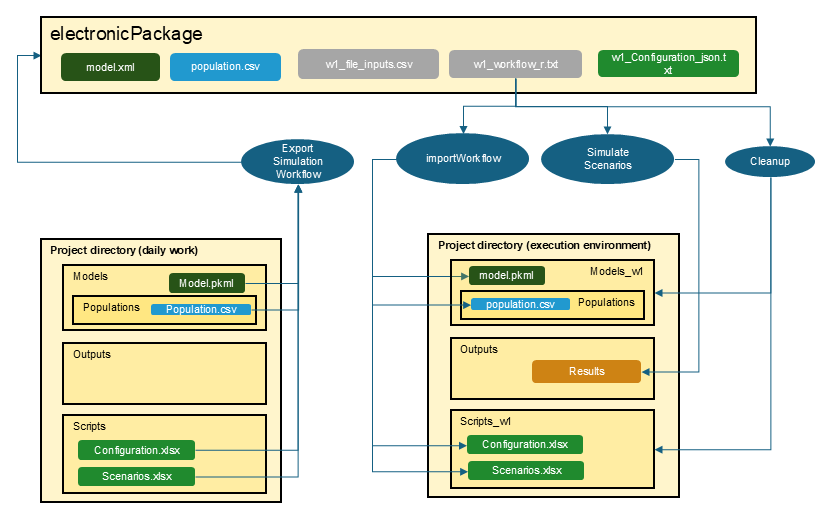

```{r, include = FALSE}
knitr::opts_chunk$set(
  collapse = TRUE,
  eval = FALSE,
  echo = TRUE,
  warning = FALSE,
  error = FALSE,
  comment = "#>"
)
```

```{r setup,echo=FALSE}
library(ospsuite.reportingframework)
```

## Introduction

In the realm of regulatory submissions, the ability to produce transparent and reproducible reports is paramount. The ePackage functionality within the OSPSuite.ReportingFramework addresses this need by allowing users to seamlessly export workflows that generate Good Clinical Practice (GCP) relevant documents into a structured electronic package. 

This functionality is designed to extract essential components from the project structure, including models, data, and configuration files, ensuring that all critical elements are systematically organized. By automating this extraction process, users can focus on their analyses without worrying about manual file management, which can lead to errors and inconsistencies.

The outputs for reports are generated through well-defined scripts included in the package. These scripts are integral to the workflow, allowing for consistent execution of analyses and ensuring that results can be easily reproduced. This not only enhances the reliability of the findings but also fosters confidence among regulatory agencies, as every output is traceable back to a standardized process.

By providing a comprehensive electronic package that consolidates all relevant files in accepted formats, such as CSV, XML, and TXT, the OSPSuite.ReportingFramework simplifies the submission process. Users can easily share this organized package with regulatory bodies, complete with README files that outline its contents and provide clear instructions for use. This approach not only streamlines the workflow but also upholds the highest standards of transparency and reproducibility in clinical research.


## Typical Workflows of an Activity

The following table outlines typical workflows associated with activities in the OSPSuite context, highlighting their relevance to the electronic package:

| Identifier   | Description                          | ePackage Relevance   | Inputs (green italic: already QCed)                                                                                                | Outputs                                     | Comments                                                                                                          |
|--------------|--------------------------------------|----------------------|------------------------------------------------------------------------------------------------------------------------------------|---------------------------------------------|-------------------------------------------------------------------------------------------------------------------|
| P1           | Preparatory scripts or action        | Internal             | Workflow script configuration tables                                                                                               | Inputs for other workflows e.g., populations |                                                                                                                   |
| We1          | Export of simulation workflow        | Internal             | Workflow script for export configuration tables, pkmls, populations                                                                 | ePackage files                              | Typically time-consuming. Customization is uncommon. Re-runs are only necessary if changes occur in the model. |
| W1           | Execution of simulation workflow     | Part of ePackage     | ePackage files                                                                                                                     | Simulation and PK-Analysis Results          | Typically time-consuming. Customization is uncommon. Re-runs are only necessary if changes occur in the model. |
| We2          | Export of TLF generation workflow    | Internal             | Workflow script for export, workflow script for execution configuration tables, custom functions, simulation and PK-Analysis Results | ePackage files                              | Fast execution. Customization is common. Re-runs are often requested.                                             |
| W2           | Execution of TLF generation workflow | Part of ePackage     | ePackage files                                                                                                                     | TLFs                                        | Fast execution. Customization is common. Re-runs are often requested.                                             |
| A1           | Appendix generation                  | Internal             | TLFs                                                                                                                               | Word document                               |                                                                                                                   |

This table illustrates how various workflows contribute to the electronic package, ensuring that all necessary components are included for successful analysis and reporting. The simulation and TLF workflows are split; the first is time-consuming but straightforward, typically executed only once in a project, while the second runs quickly and is often executed multiple times as figures are refined during discussions.

## Electronic Package Folder

The folder for the electronic package is part of the project configuration. You can access it by calling `projectConfiguration$addOns$electronicPackageFolder` and set it to another folder by overwriting the default:

```{r}
projectConfiguration$addAddOnFolderToConfiguration(
      property = 'electronicPackageFolder',
      value = 'my/new/path',
      description = 'my custom folder for ePackage'
)
```

The exported electronic package will contain the following after the export:
- All relevant model, population, data, configuration, and script files organized in a flat directory structure needed to reproduce the results.
- All files will be in accepted formats such as CSV, XML, and TXT with valid file names.

You should manually add:
- README files that outline the contents of the package and instructions for use.

Once you have exported the workflows, you can use them internally to produce your results or share this folder with regulatory agencies.

## How to Use the Workflow Exporter

### Step 1: Setting Up Inputs for Your Workflow

Before exporting your workflow, ensure that you have completed the necessary steps in your analysis. This includes defining your input data, setting up your models, and exporting populations.

### Step 2: Simulation Workflows

1. **Exporting Simulation Workflows**

   To export your simulation workflow, utilize the `exportSimulationWorkflowToEPackage()` function. This function uses the project structure you have built in your daily work and exports necessary files into the electronic package folder. (See figure below) All files are checked for valid file names and valid formats. Only the necessary sheets and entries of the configuration files are exported. 
   
Here’s how to use it:

```{r exportSimulationWorkflowToEPackage}
   # Export the simulation workflow to an electronic package
   exportSimulationWorkflowToEPackage(projectConfiguration = projectConfiguration,
                                       wfIdentifier = 1,
                                       scenarioNames = c('scenario1', 'scenario2')
   )
```

You just need to provide the workflow with an identifier and specify the scenarios you want to use. See the function help `? exportSimulationWorkflowToEPackage` for more information.

2. **Running Simulation Workflows**

Within the electronic package folder, a workflow file will now exist. For `wfIdentifier = 1`, it will be `w1_workflow_r.txt`.

At the beginning of the workflow, a variable `projectDirectory` is defined. By default, it is set to your current project directory. If only the package is available, this has to be adjusted.

As shown in the figure below, the workflow consists of three steps

- **importWorkflow**: The first step builds a project directory with all necessary folders and files to simulate the scenarios. The output folder uses the same name as in your project configuration, while all other folders are newly generated with the suffix `_w<wfIdentifier>`. This ensures that you do not accidentally overwrite existing files like configuration tables.

- **scenario simulation**: The scenarios are simulated and filed as usual. Existing results in the output folder will be overwritten.

- **Cleanup**: All temporary folders are deleted. If you want to keep the folders, set the variable `Cleanup` at the beginning of the workflow to `FALSE`.



### Step 3: TLF Workflows

1. **Exporting TLF Workflows**

The implementation of the TLF generation workflow is similar to that of the simulation workflow. However, while the simulation workflow requires only a list of scenarios for export, the TLF generation process necessitates additional information, such as:

- Data to be used
- Plot functions, plot configuration, and inputs
- Custom functions

The workflow export uses a `workflow.Rmd` as input. The `workflow.Rmd` resembles a 'normal' workflow, and executing the Rmd in the daily work environment generates the desired plots. All steps are structured to be easily read and understood by the workflow importer.

The package provides a template for the `workflow.Rmd`. You can open a template for `workflow.Rmd` using the Addins feature in RStudio. This template provides a structured format to guide you in creating your TLF workflow. Simply navigate to the Addins menu in RStudio and select the option `Open Template ePackage Workflow RMD`, or call `openEPackageTemplate()`. The template contains further documentation on how to use it.

Below is the export call using the 'workflow.Rmd' as input:

```{r exportTLFWorkflowToEPackage}
   # Export the TLF workflow to an electronic package
   exportTLFWorkflowToEPackage(projectConfiguration = projectConfiguration,
                               wfIdentifier = 2,
                               workflowRmd = 'path/to/myWorkflow.Rmd'
   )
```

See the function help `? exportTLFWorkflowToEPackage` for more information.

2. **Running TLF Workflows**

Running a TLF workflow is very similar to running a simulation workflow; however, in Step 2, it will produce figures instead of simulating scenarios.

### Step 4: Report Generation

While the ePackage functionality ensures that all figures and tables can be reproduced consistently, the process of generating a comprehensive report that combines these elements into a Word document is not included within the workflows included in the ePackage. 

To create a cohesive report, you can use the report generation functionality of this package, which will use the markdown documents produced by the ePackage. See vignette 'Plot and Report Generation' for more information


## Conclusion

In summary, the ePackage functionality of the OSPSuite.ReportingFramework is a powerful tool designed to enhance the efficiency and reliability of regulatory submissions. By automating the extraction and organization of essential components from project structures, this feature significantly reduces the risk of error and ensures that all necessary files are readily available in a standardized format.

The ability to generate reproducible reports through well-defined scripts not only streamlines the workflow but also fosters confidence among stakeholders by providing transparency in the analysis process. With the inclusion of comprehensive README files and the option to customize the electronic package, users can tailor their submissions to meet specific regulatory requirements.

As you explore the capabilities of the OSPSuite.ReportingFramework, we encourage you to leverage the ePackage functionality to enhance your reporting processes. By embracing these tools, you can ensure that your clinical research is presented with the highest standards of integrity and clarity, ultimately contributing to the advancement of scientific knowledge and regulatory compliance.

For further assistance or to share your experiences with the ePackage functionality, please feel free to reach out to the community or consult the official documentation.

